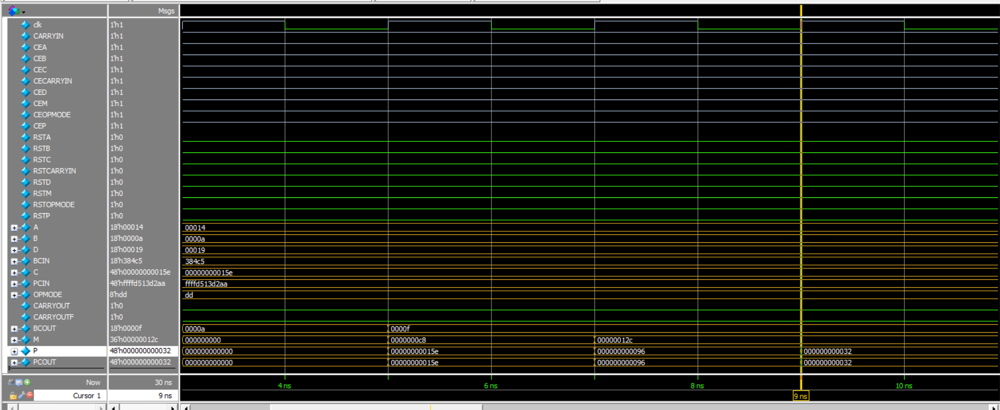
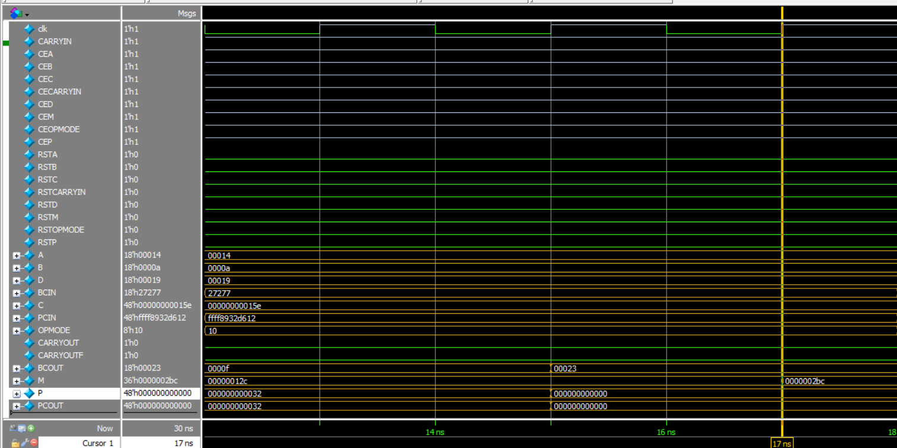
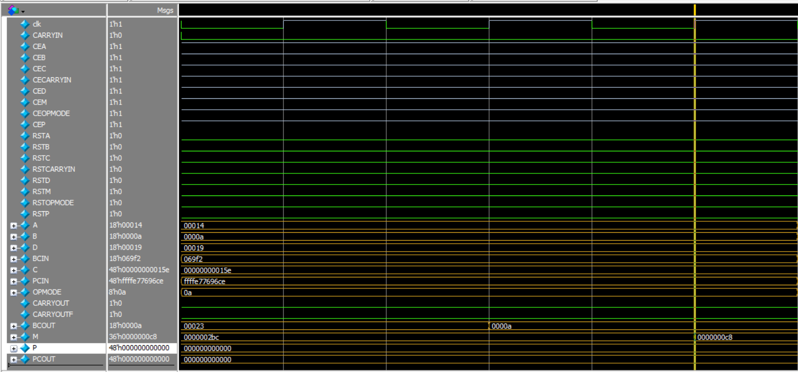
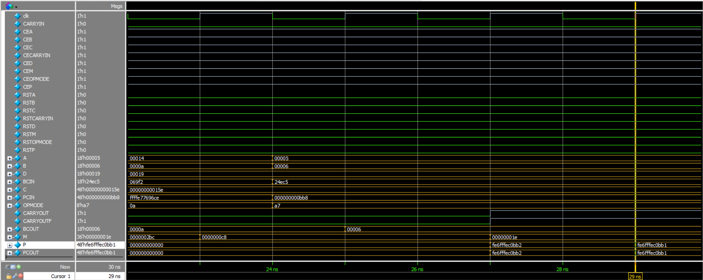
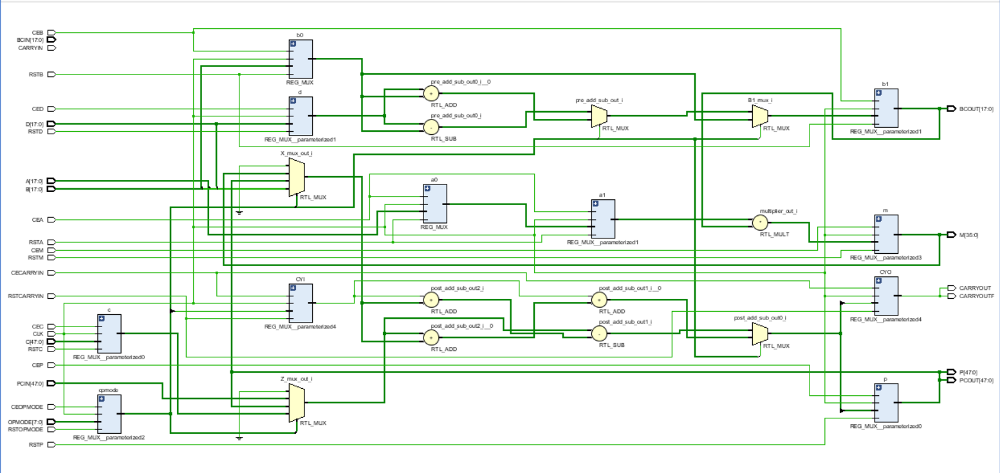
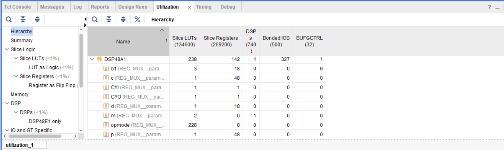
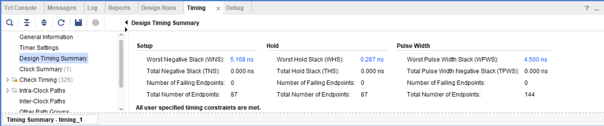
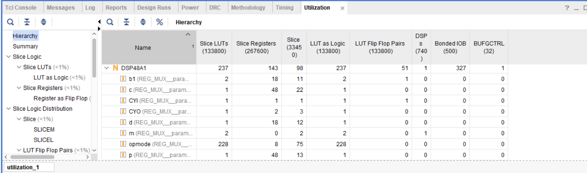
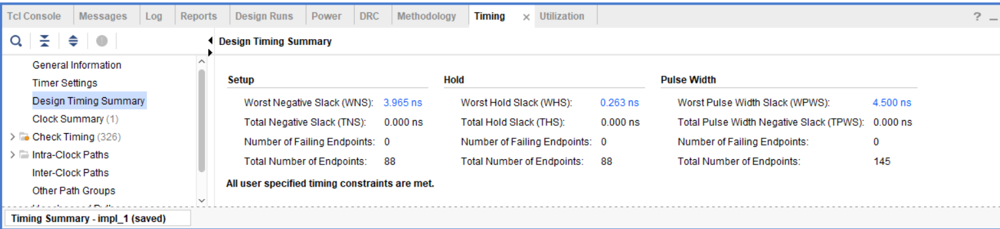
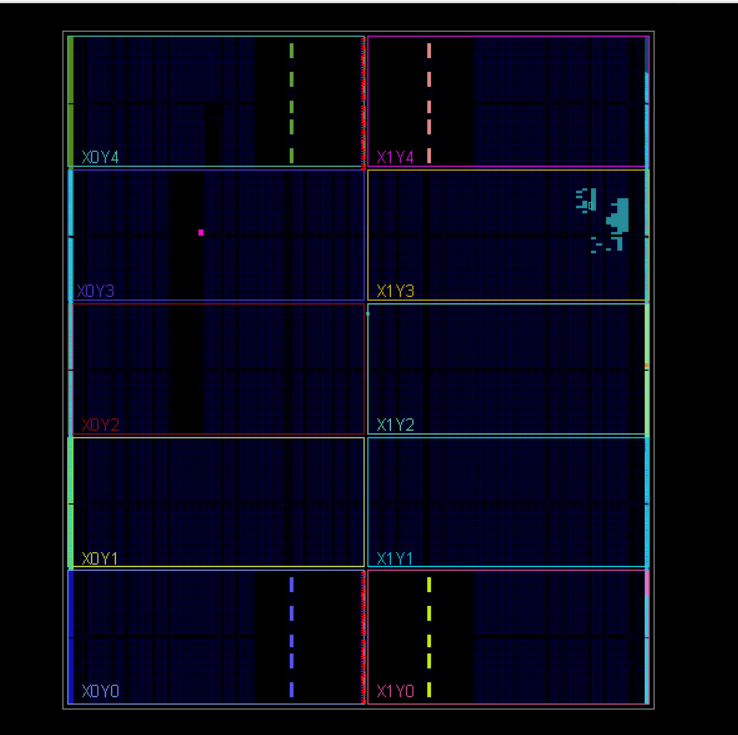

# 🧮 DSP48A1 Slice Simulation & Verification  

A complete Verilog design and verification project simulating the behavior of a **Spartan-6 DSP48A1 slice**, based on Xilinx architecture.

---

## 📌 Project Overview  

This project implements a configurable **DSP48A1 slice** in Verilog, featuring:
- Parameterized DSP design following Xilinx DSP48A1 behavior.
- Testbench verifying four functional paths via `OPMODE`.
- Simulation using **QuestaSim** + full FPGA flow via **Vivado**.
- Clean elaboration, synthesis, implementation, and linting results.

---

## 📁 Files Included

| File                    | Description                                |
|-------------------------|--------------------------------------------|
| `DSP58A1.v`             | Main DSP slice module                      |
| `REG_MUX.v`             | Register + Multiplexer helper module       |
| `tb_DSP58A1.v`          | Testbench verifying 4 data paths           |
| `DSP58A1.do`            | Simulation automation script for QuestaSim |
| `Contraints_basys.xdc`  | Constraints file (clock = 100 MHz @ W5)    |

📂 `docs/` folder includes all screenshots (schematics, waveforms, timing, and utilization reports).

---

## 🧪 Testbench Functional Paths

Each DSP path is tested with controlled `OPMODE` values and delayed output checking based on pipeline register stages:

1. **Path 1**: Pre-subtractor + Multiplier + C input  
   

2. **Path 2**: Pre-adder + zero propagation  
   

3. **Path 3**: Feedback-based accumulator  
   

4. **Path 4**: D:A:B concatenation + PCIN  
   

Each test path includes self-checking verification.

---

## 🧰 Tools Used

- 🛠 **Vivado** for elaboration, synthesis, implementation  
- 🔍 **QuestaSim** for testbench simulation  
- ✔️ **Linting** for clean HDL validation

---

## 💡 FPGA Targeting Info

- **Part**: `xc7a200tffg1156-3` (larger IO support)
- **Clock**: 100 MHz (`W5` pin in `Contraints_basys.xdc`)
- ✅ No critical warnings or errors in flow steps

---

## 📊 Flow Outputs

| Phase                   | Snapshot |
|-------------------------|----------|
| Elaboration             |  |
| Synthesis (Utilization) |  |
| Synthesis (Timing)      |  |
| Implementation (Util.)  |  |
| Implementation (Timing) |  |
| Device View             |  |

---

## 🔍 Clean Linting & Logs

- ✅ No design rule violations or syntax issues
- ✅ Linting Passed 

---

## 📚 References

- 📄 [Xilinx UG389 - Spartan-6 DSP48A1 Slice](https://www.xilinx.com/support/documentation/user_guides/ug389.pdf)  

---

